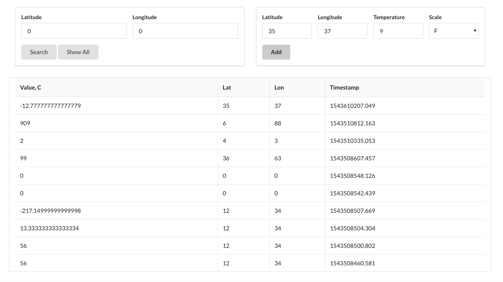

# Temperatures

REST API + Ract client app for accepting temperature data from a sensor and retrieving most recent records.



## Run

To run both client and server you need to build the server jar first and then run the docker-compose config
```bash
cd server/ && ./gradlew bootJar && cd ..
docker-compose up
```
## Stack
- Spring Boot
- Spring Data MongoDB
- Spring Rest
- React
